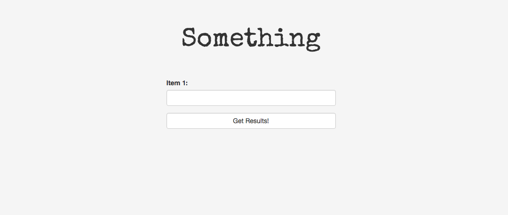
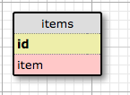

# Project Title
Version 0.1.0: October 7, 2016

by [Karen Freeman-Smith](https://github.com/karenfreemansmith)

## Description
This is a generic template for Java/Spark/Postgres projects

### Specifications
#### User Stories:
* As a user, I can input an item and see it printed as the title of the page.

#### Database Diagram:
(create diagram at - http://ondras.zarovi.cz/sql/demo/)

#### Technical Specifications:
(make table at - http://www.tablesgenerator.com/markdown_tables)

| Behavior                   	| Input        	| Output                 	|
|----------------------------	|--------------	|------------------------	|
| Stores description of item 	| "item one"   	| "item one"             	|
| Updates item               	| "other item" 	| "other item"           	|
| Finds an item by id        	| 1            	| "item one"             	|
| List all items             	| n/a          	| returns multiple items 	|
| Deletes item               	| n/a          	| null                   	|

## Setup/Installation
* Clone directory
* Setup database in PSQL:
  * CREATE DATABASE test;
  * \c test
  * CREATE TABLE items (id serial PRIMARY KEY, item varchar);
* Type 'gradle run' inside the directory
* Navigate to 'http://localhost:4567'

## Support & Contact
For questions, concerns, or suggestions please email karenfreemansmith@gmail.com

## Known Issues
* N/A

## Technologies Used
Java, JUnit, Spark, PostgreSQL, Gradle

## Legal
*Licensed under the GNU General Public License v3.0*

Copyright (c) 2016 Copyright _Karen Freeman-Smith_ All Rights Reserved.
